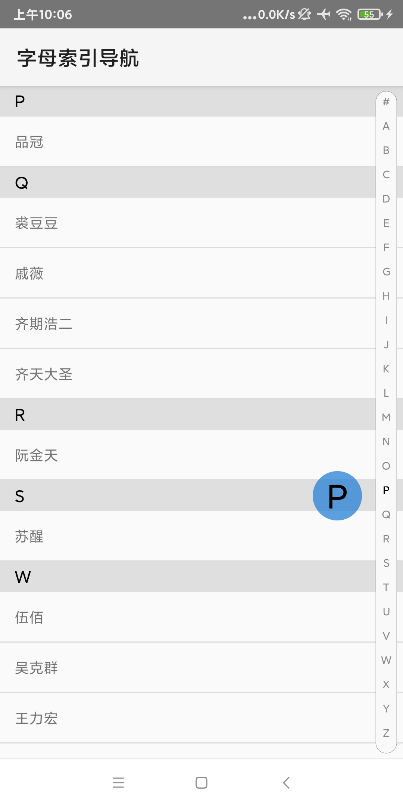

# KennieLetterIndexBar

<p align="center"></p>

<p align="center">
    <strong>字母索引导航</strong>
    <br>
    <a href="https://kennielab.github.io/KennieLetterIndexBar/">使用文档</a>
    <br>
</p>

<p align="center">


</p>


## 简介

字母索引导航

如有任何疑问或者Bug，请在 github 上公开讨论[技术问题](https://github.com/kennielab/KennieLetterIndexBar/issues)

**开源不易，如果喜欢的话希望给个 `Star` 或 `Fork` ^_^ ，谢谢~~**


## 预览




## 如何使用

### 1. 项目根目录的 build.gradle 的 buildscript 添加
```
allprojects {
     repositories {
        ...
        maven { url "https://jitpack.io" }
    }
}
```

### 2.然后在 dependencies 添加 

Latest Version：[](https://jitpack.io/#kennielab/KennieLetterIndexBar)

```gradle
dependencies {
  implementation 'com.github.kennielab:KennieLetterIndexBar:{Latest Version}'
}
```
#### XML
```xml
    <com.kennie.library.indexbar.LetterIndexBar
        android:id="@+id/side_view"
        android:layout_width="wrap_content"
        android:layout_height="wrap_content" />
```
#### Attrs
```xml
    <declare-styleable name="LetterIndexBarView">
        <!--索引文字大小-->
        <attr name="indexTextSize" format="dimension" />
        <!--索引文字颜色-->
        <attr name="indexTextColor" format="color|reference" />
        <!--侧边栏背景颜色-->
        <attr name="sidebarBackgroundColor" format="color|reference" />
        <!--侧边栏选中颜色-->
        <attr name="sidebarChooseTextColor" format="color|reference" />
        <!--侧边栏文字放大大小-->
        <attr name="sidebarLargeTextSize" format="dimension" />
        <attr name="sidebarRadius" format="dimension" />
        <attr name="sidebarBallRadius" format="dimension" />
    </declare-styleable>
```

## 更新日志
- [详细日志](./UPDATELOG.md)

### 1.0.0

- 第一版试水

## 注意事项

> **使用前请查看注意事项**，当前版本仅支持AndroidX

### 构建环境

> 最低支持api 21

    compileSdk 30
    minSdk 21
    targetSdk 30

> 开发环境

    AndroidStudio ArcticFox 2020.3.1
    JDK 1.8 || JDK 11
    kotlin 1.5.31
    gradle-7.0.2-bin & gradle 7.0.2

> 运行环境

   手机端 Android7.0 ~ Android 11.0

## 联系方式
- 微信：**lkweixh**
- 邮箱：245794335@qq.com

## 赞赏

**如果您觉得还不错，您可以打赏哦，您的支持将是我持续维护的动力。**

|  微信支付 |
|--|
|   |

## 感谢

- [AliyunGradleConfig](https://github.com/gzu-liyujiang/AliyunGradleConfig)
- [Android 代码规范文档](https://gitee.com/getActivity/AndroidCodeStandard)
- [阿里矢量图](https://www.iconfont.cn/)
- [花瓣](https://huaban.com/)

## LICENSE

```
Copyright (c) 2020-2021 kennie

Licensed under the Apache License, Version 2.0 (the "License");
you may not use this file except in compliance with the License.
You may obtain a copy of the License at

   http://www.apache.org/licenses/LICENSE-2.0

Unless required by applicable law or agreed to in writing, software
distributed under the License is distributed on an "AS IS" BASIS,
WITHOUT WARRANTIES OR CONDITIONS OF ANY KIND, either express or implied.
See the License for the specific language governing permissions and
limitations under the License.
```