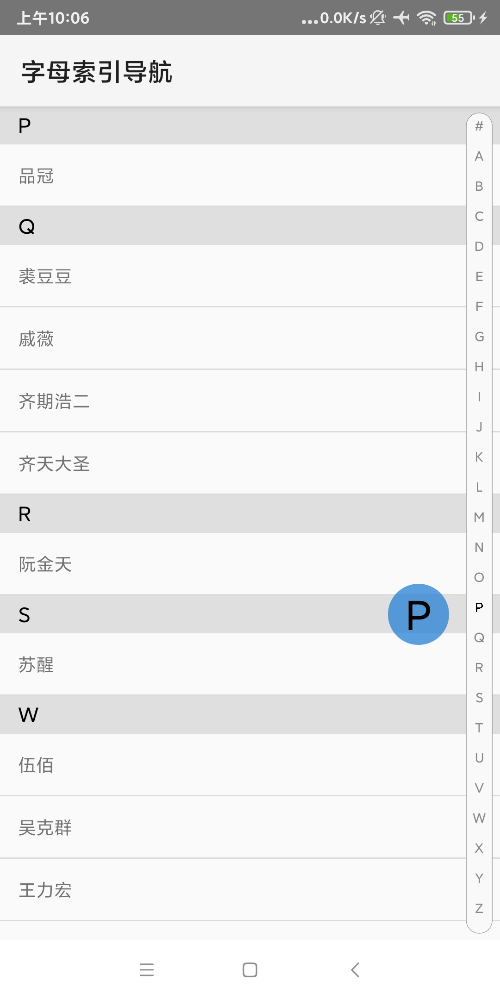

## KennieLetterIndexBar(字母索引导航)

## 预览




## 如何使用

### 1. 项目根目录的 build.gradle 的 buildscript 添加
```
allprojects {
     repositories {
        ...
        maven { url "https://jitpack.io" }
    }
}
```

### 2.然后在 dependencies 添加 

Latest Version：[](https://jitpack.io/#kennielab/KennieLetterIndexBar)

```gradle
dependencies {
  implementation 'com.github.kennielab:KennieLetterIndexBar:1.0.0'
}
```
#### XML
```xml
    <com.kennie.library.indexbar.LetterIndexBarView
        android:id="@+id/side_view"
        android:layout_width="wrap_content"
        android:layout_height="wrap_content" />
```
#### Attrs
```xml
    <declare-styleable name="LetterIndexBarView">
        <!--索引文字大小-->
        <attr name="indexTextSize" format="dimension" />
        <!--索引文字颜色-->
        <attr name="indexTextColor" format="color|reference" />
        <!--侧边栏背景颜色-->
        <attr name="sidebarBackgroundColor" format="color|reference" />
        <!--侧边栏选中颜色-->
        <attr name="sidebarChooseTextColor" format="color|reference" />
        <!--侧边栏文字放大大小-->
        <attr name="sidebarLargeTextSize" format="dimension" />
        <attr name="sidebarRadius" format="dimension" />
        <attr name="sidebarBallRadius" format="dimension" />
    </declare-styleable>
```


